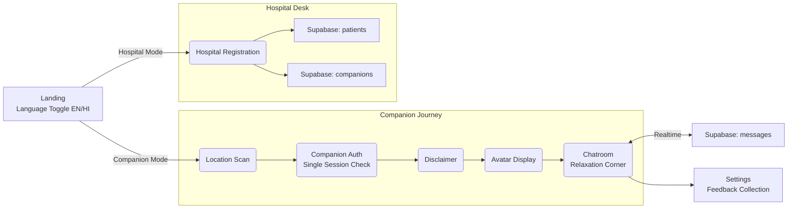
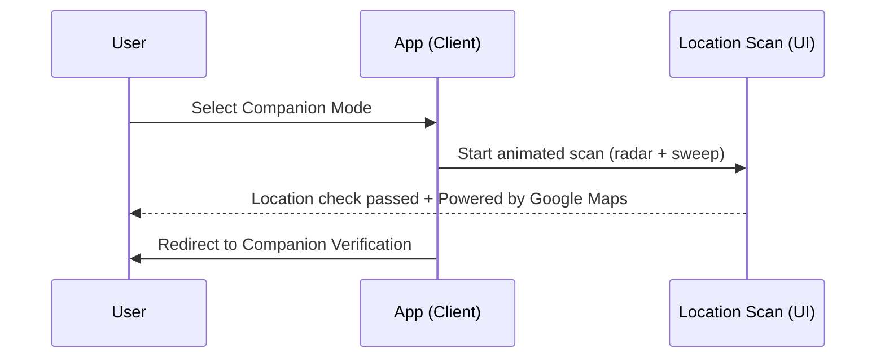
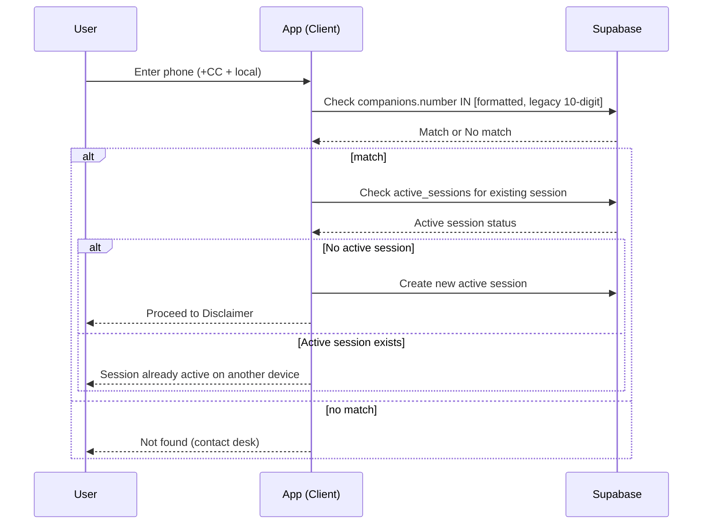
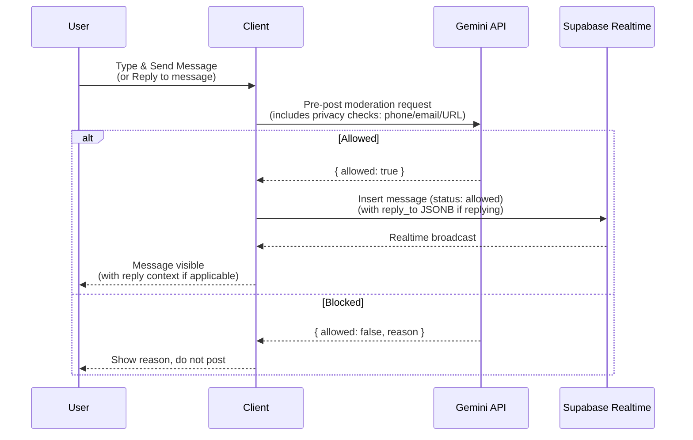
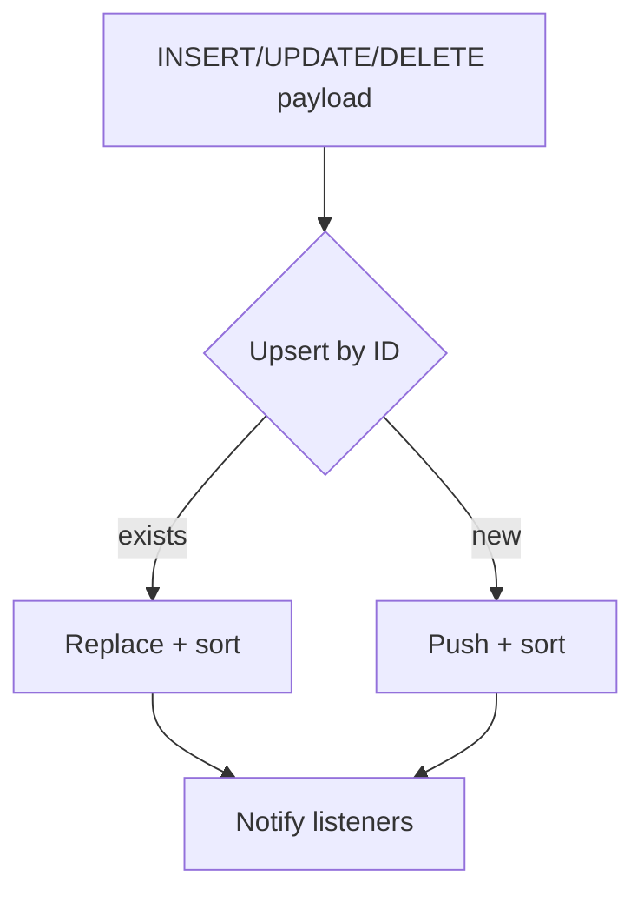
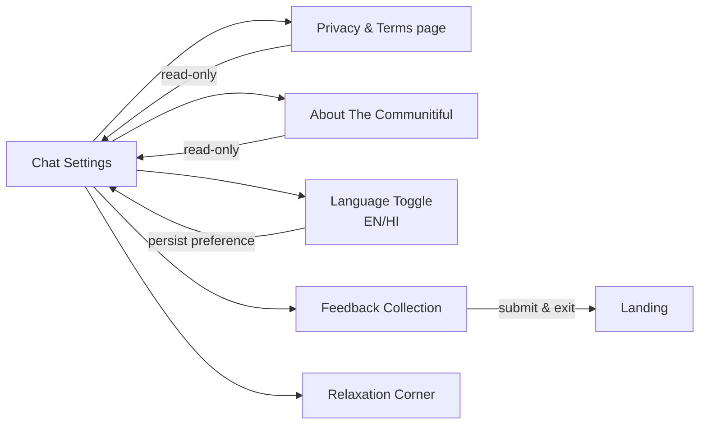
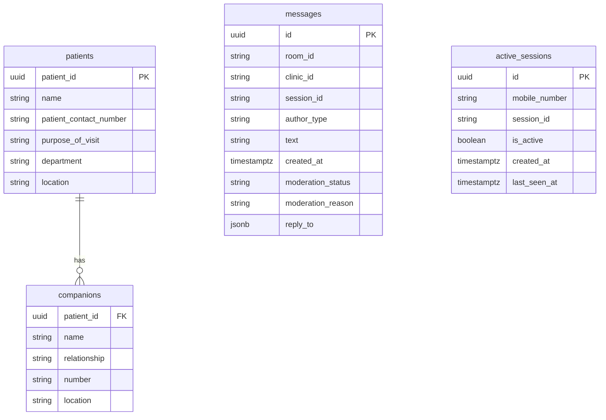
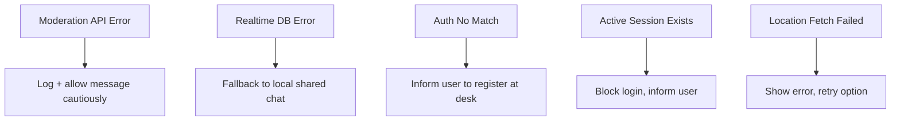
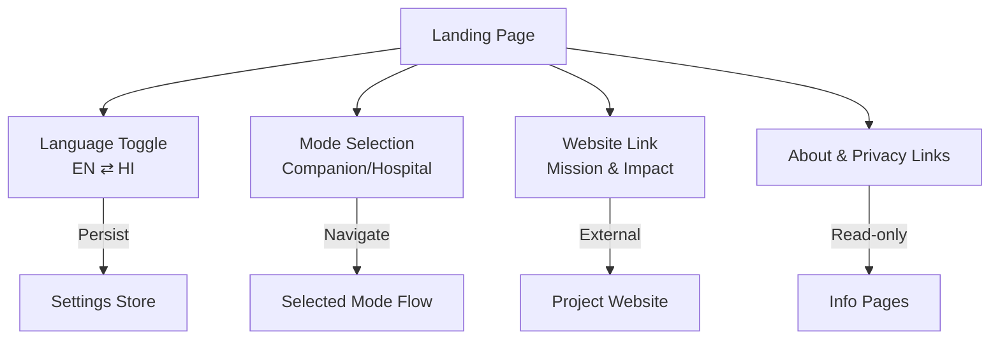

# Leadership Flow Diagrams — The Communitiful

This document summarizes key user journeys and system flows for leadership review. Diagrams use Mermaid for clarity and can be previewed in Markdown viewers that support Mermaid.

---

## 1) Overview — Modes and Core Surfaces



---

## 2) Hospital Registration — Patient + Companions

```mermaid
flowchart TD
  A[Registration Form] --> B[Patient Details]
  A --> C[Companion Details (1..n)]

  B --> B1{Validate}
  B1 -->|ok| B2[Format patient number +country code]
  B1 -->|error| A

  C --> C1{Validate each companion}
  C1 -->|ok| C2[Format number +country code]
  C1 -->|error| A

  B2 --> D[Insert patients]
  C2 --> E[Insert companions]

  D --> F[Registration Complete]
  E --> F
```

Notes:
- International phone format is stored as “+<country_code><local_number>”.
- Form is mobile/tablet friendly for front-desk use.

---

## 3) Companion Mode — Entry Flow



---

## 4) Companion Verification — Authentication with Single Session Check



Notes:
- Single active session enforcement prevents multi-device access per mobile number.
- Database-backed session tracking via `active_sessions` table.

---

## 5) Disclaimer → Identity → Chatroom

```mermaid
flowchart LR
  A[Disclaimer (no medical advice)] --> B[Anonymous Identity]
  B -->|nickname + avatar| C[Avatar Display]
  C --> D[Chatroom]
  D --> E[Relaxation Corner]
  D --> F[Settings]
```

Avatar:
- Session assigns an emoji-based avatar and nickname (non-editable per session).
- Avatar display shown before entering chatroom.

---

## 6) Message Lifecycle with Moderation & Reply Support



Block criteria (non-exhaustive):
- Abuse/harassment, hate/discrimination, violence/threats
- Sexual content, self-harm
- Medical misinformation
- Spam/ads/links, off-topic or religious/political preaching
- Excessively disturbing/negative content
- **Privacy violations:** Mobile numbers, email addresses, URLs

Reply functionality:
- Long-press (500ms) or swipe right to reply to any message
- Reply context stored in `reply_to` JSONB field (messageId, text snippet, sender info)
- Clickable jump-to-original message with smooth scroll animation

---

## 7) Realtime Chat — De-duplication & Presence



Presence:
- Local “shared chat” and presence simulation with typing indicators.

---

## 8) Settings, Privacy & About



Notes:
- Settings navigates to Privacy & Terms or About The Communitiful pages (read-only).
- Language preference persists across sessions.
- Feedback collection allows users to share experience before exiting.
- Relaxation Corner accessible from both Settings and Chatroom.

---

## 9) Data Model (Simplified)



Notes:
- `messages.reply_to` stores reply context as JSONB (messageId, text snippet, sender name, avatar).
- `active_sessions` enforces single active session per mobile number.

---

## 10) Error & Fallback Scenarios



Notes:
- Single session enforcement blocks concurrent logins gracefully.
- Location fetching failures provide clear user feedback.

---

## 10.5) Landing Page Features



Notes:
- Language toggle prominently displayed at top of landing page.
- Language preference persists across sessions via Zustand store.
- Website integration provides external link to project information.
- All features accessible before mode selection.

---

## 11) Branding & Partner Context

- **The Communitiful** brand name displayed on landing page and throughout app.
- Apollo Hospital branding appears in chatroom header.
- "Powered by Google Maps" displayed in the location scan step UI.
- Website integration link on landing page for mission and impact information.
- Bilingual interface (English/Hindi) with prominent language toggle.

---

## 12) Key Decisions & Rationale

- Pre-post moderation guarantees harmful content never lands in the room.
- International phone format ensures future scalability and consistency.
- Animated, calm UI elements are chosen to reduce stress during waiting.
- **Single active session** prevents security issues and ensures one user per account.
- **Bilingual support** (English/Hindi) improves accessibility for diverse user base.
- **Reply functionality** enhances conversation context and user engagement.
- **Relaxation Corner** provides stress-relief tools during waiting periods.
- **Privacy protection** blocks contact sharing (phone/email/URL) automatically.
- **Feedback collection** enables continuous improvement based on user experience.

---

For deeper implementation details, see:
- `app_docs/README.md` (full system overview)
- `app_docs/Implementation_Document.md` (implementation highlights)
*** End Patch

