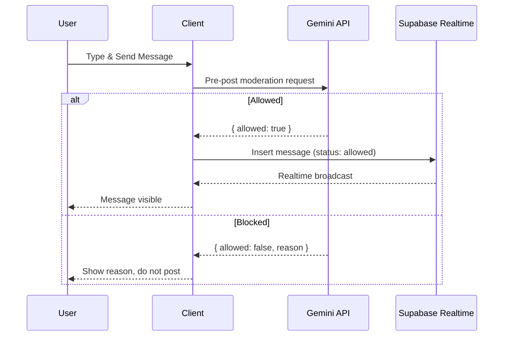

# Leadership Flow Diagrams — Companions Anonymous

This document summarizes key user journeys and system flows for leadership review. Diagrams use Mermaid for clarity and can be previewed in Markdown viewers that support Mermaid.

---

## 1) Overview — Modes and Core Surfaces


---

## 2) Hospital Registration — Patient + Companions

```mermaid
flowchart TD
  A[Registration Form] --> B[Patient Details]
  A --> C[Companion Details (1..n)]

  B --> B1{Validate}
  B1 -->|ok| B2[Format patient number +country code]
  B1 -->|error| A

  C --> C1{Validate each companion}
  C1 -->|ok| C2[Format number +country code]
  C1 -->|error| A

  B2 --> D[Insert patients]
  C2 --> E[Insert companions]

  D --> F[Registration Complete]
  E --> F
```

Notes:
- International phone format is stored as “+<country_code><local_number>”.
- Form is mobile/tablet friendly for front-desk use.

---

## 3) Companion Mode — Entry Flow


---

## 4) Companion Verification — Authentication


---

## 5) Disclaimer → Identity → Chatroom

```mermaid
flowchart LR
  A[Disclaimer (no medical advice)] --> B[Anonymous Identity]
  B -->|nickname + avatar| C[Chatroom]
```

Avatar:
- Session assigns an emoji-based avatar and nickname (non-editable per session).

---

## 6) Message Lifecycle with Moderation



Block criteria (non-exhaustive):
- Abuse/harassment, hate/discrimination, violence/threats
- Sexual content, self-harm
- Medical misinformation
- Spam/ads/links, off-topic or religious/political preaching
- Excessively disturbing/negative content

---

## 7) Realtime Chat — De-duplication & Presence


Presence:
- Local “shared chat” and presence simulation with typing indicators.

---

## 8) Settings, Privacy & About


Notes:
- Settings navigates to Privacy & Terms or About Companions pages (read-only).

---

## 9) Data Model (Simplified)


---

## 10) Error & Fallback Scenarios


---

## 11) Branding & Partner Context

- Apollo Hospital branding appears in chatroom header.
- “Powered by Google Maps” displayed in the location scan step UI.

---

## 12) Key Decisions & Rationale

- Pre-post moderation guarantees harmful content never lands in the room.
- International phone format ensures future scalability and consistency.
- Animated, calm UI elements are chosen to reduce stress during waiting.

---

For deeper implementation details, see:
- `app_docs/README.md` (full system overview)
- `app_docs/Implementation_Document.md` (implementation highlights)
*** End Patch

